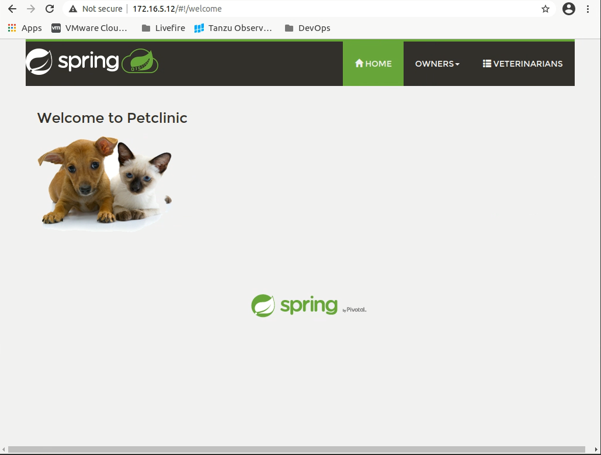
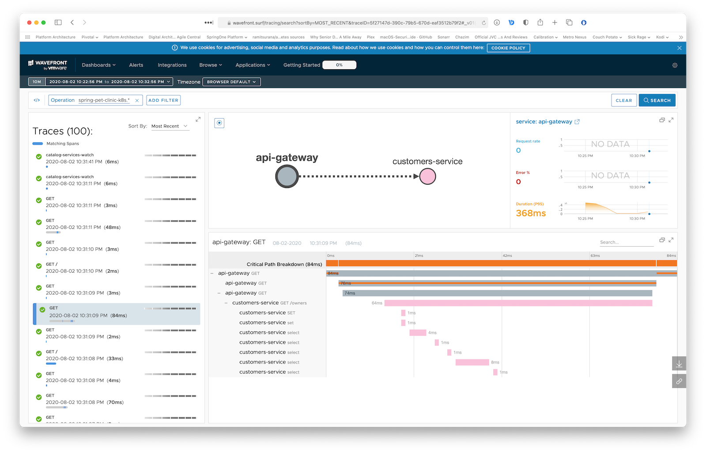
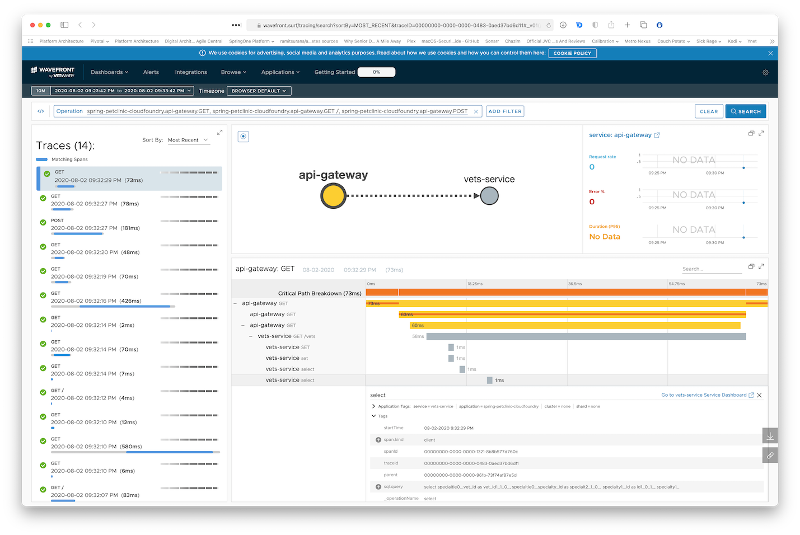

## The Point --Test

Of this project is to supply an easy Microservices Tracing Demo for Tanzu Observability Powered by Wavefront

It should be deployable to any kubernetes environment, minikube, AKS, TKG, etc.

That said, a TKGs (Tanzu Kubernetes Grid on vSphere 7) was used during the development of this project, so some things may not match what you see exactly in your environment.

Steps to Deploy the Demo

1. #### Grab the Containers Images ####

Open [IMAGES](./IMAGES.MD) for instructions on grabbing the container images

2. #### Modify deployment yaml files for your needs ####

Open [CHANGES](./CHANGES.MD) for those details


3. #### Deploy the application ####

Open [DEPLOYAPP](./DEPLOYAPP.MD) for step by step on deploying the application to kubernetes

#### Now that the App Is deployed and runnnig we can get to the POINT


4. Get the `EXTERNAL-IP` of the API Gateway:

```
✗ kubectl get svc -n spring-petclinic api-gateway 
NAME          TYPE           CLUSTER-IP    EXTERNAL-IP      PORT(S)        AGE
api-gateway   LoadBalancer   10.7.250.24   34.1.2.22   80:32675/TCP   18m
```

Browse to api-gateway EXTERNAL-IP in your browser and see the application running.



As The goal of this demo is to get Tracing data into Tanzu Observability by Wavefront, it would be good if we had some traces. To do that we have provided a jmeter test plan 

5. Open [The jmeter README](./jmeter/README.MD) for this demo


6. After you have jemeter running properly browse to api-gateway IP in your browser and see the application running.


7. Open Wavefront and you should see monitoring and traces from Wavefront under the application name you configurd i.e. `spring-petclinic-k8s`:




Access the one-time URL you received when bootstraping Wavefront to see Zipkin traces and other monitoring of your microservices:


Since we've included `brave.mysql8` in our `pom.xml`, the traces even show the various DB queries traces:




Future Work - nothing to see here 

Open [PROMETHEUS SETUP](BAD-PROMGRAF.MD)
