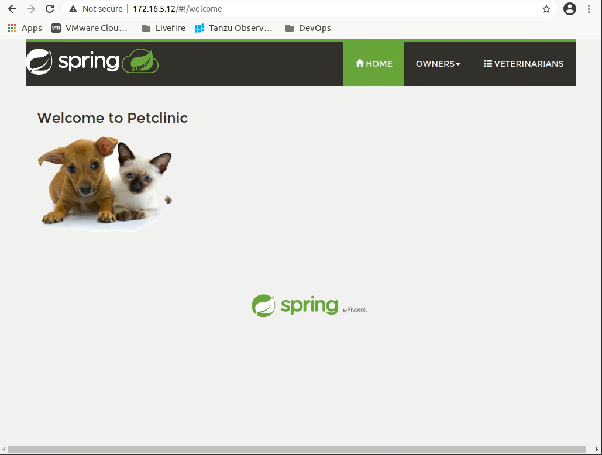
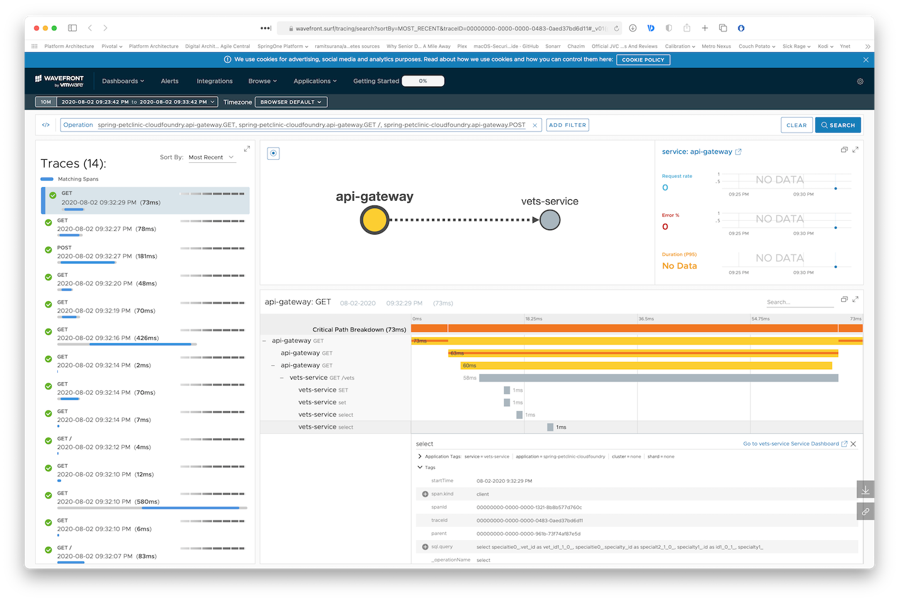

## The Point

Of this project is to supply an easy Microservices Tracing Demo for Tanzu Observability Powered by Wavefront

It should be deployable to any kubernetes environment. minikube, aks, TKG, etc.

That said, a TKGs (Tanzu Kubernetes Grid on vSphere 7) was used during the development of this project, so some things may not match what you see exactly in your environment.

### Getting the images
I've built some scripts for pulling the images needed for this demo from my dockerhub "benhtodd". 

The sceripts are rudamentary but they will get the job done. 

Convention used:  
**SRC_PREFIX=** i.e. benhtodd

**SRC_IMAGE_TAG=** In my dockerhub I will only have one version so it's always 1.0 not latest.

**TAR_PREFIX=** Where do you want to send the image. For example harbor uses host and repo name so an example might be "harbor.local/petclinic"

**TAR_IMAGE_TAG=** I leave your version tagging up to you of course

### Change kubernetes deployment files to meet your needs

In the k8s directory you will find all the files you need to deploy the petclininc app. You will have to make some small changes to the yaml files to match yuour environment. 

./spring-petclinic/k8s/init-app - is for "initializing" your cluster for the app to be deployed. The yamls in there create namespaces and create app services needed. There is one file that needs to be modified for your environment.

02-config-map.yaml - has a block 

```
    wavefront:
      application:
        name: <app name>
      freemium-account: true
```
You will want to change the value of **name:** to match what you want reflected in wavefront tracing

In ./spring-petclinic/k8s/ there are four yaml files that will need to be updated to reflect your image repo. *api-gate-deployment.yaml*, *customers-service-deployment.yaml*, *vets-service-deployment.yaml*, and *visits-service-deployment.yaml* all will need to have their Spec -- containers -- image value set to where you pushed the base images to. 

**You Can pull from my docker hub repo benhtodd** but I assume you will want to move them to your own.


### Setting things up in Kubernetes

We will need to create some namespaces, and while we are at it we can create the services the petclinc app uses. For convienence we have put them all in one folder call init-app

```
kubectl apply -f k8s/init-app/ 
```
### Verify Environent so far

Verify the namespace creation

```
✗  k get ns
NAME                           STATUS   AGE
default                        Active   4d22h
kube-node-lease                Active   4d22h
kube-public                    Active   4d22h
kube-system                    Active   4d22h
spring-petclinic               Active   42h
vmware-system-auth             Active   4d22h
vmware-system-cloud-provider   Active   4d22h
vmware-system-csi              Active   4d22h
vmware-system-tmc              Active   4d22h
wavefront                      Active   42h
```


Verify the services are available:

```
✗ kubectl get svc -n spring-petclinic
NAME                TYPE           CLUSTER-IP     EXTERNAL-IP   PORT(S)             AGE
api-gateway         LoadBalancer   10.7.250.24    <pending>     80:32675/TCP        36s
customers-service   ClusterIP      10.7.245.64    <none>        8080/TCP            36s
vets-service        ClusterIP      10.7.245.150   <none>        8080/TCP            36s
visits-service      ClusterIP      10.7.251.227   <none>        8080/TCP            35s
wavefront-proxy     ClusterIP      10.7.253.85    <none>        2878/TCP,9411/TCP   37s
```

### Deploy Wavefront Proxy to Cluster in wavefront namespace

We are going to use Helm to install the wavefront proxy.

We have already create the wavefront namespace so now we need to add the wavefront repository and update helm on your machine

```
helm repo add wavefront https://wavefronthq.github.io/helm/ && helm repo update
```

Now we can run the helm chart to deploy the wwavefront-proxy

```
helm install wavefront wavefront/wavefront --namespace wavefront \
    --set clusterName=<your student id> \
    --set wavefront.url=https://longboard.wavefront.com \
    --set wavefront.token=<wavefront token> \
    --set projectPacific.enabled=true \
    --set proxy.traceZipkinApplicationName=spring-petclinic \
    --set proxy.zipkinPort=9411 \
    --set collector.logLevel=info
```

### Settings up databases with helm

We'll now need to deploy our databases. For that, we'll use helm again.

Make sure you have a single `default` StorageClass in your Kubernetes cluster:

```
✗ kubectl get sc
NAME                                PROVISIONER              RECLAIMPOLICY   VOLUMEBINDINGMODE   ALLOWVOLUMEEXPANSION   AGE
vsphere-with-kubernetes (default)   csi.vsphere.vmware.com   Delete          Immediate           true                   4d23h
```

Deploy the databases:

```
helm repo add bitnami https://charts.bitnami.com/bitnami
helm repo update
helm install vets-db-mysql bitnami/mysql --namespace spring-petclinic --version 6.14.3 --set db.name=service_instance_db
helm install visits-db-mysql bitnami/mysql --namespace spring-petclinic  --version 6.14.3 --set db.name=service_instance_db
helm install customers-db-mysql bitnami/mysql --namespace spring-petclinic  --version 6.14.3 --set db.name=service_instance_db
```

### SetUp to pull from Images Ued in this deme

Setup an env varible to target the Docker registry.

```
export DOCKERUSER=benhtodd
export REPOSITORY=spring_petclinic
```

For other Docker registries, provide the full URL to your repository, for example:

```
export REPOSITORY_PREFIX=harbor.myregistry.com/demo
```

Now we can pull the images to be used.

Run the pull script in ./scripts to pull working images from dockerhub (this can be skipped if you want to deploy directly from dockerhub)

'''
./script/p


### Deploying the application


ullImagees.sh
'''

Our deployment YAMLs have a placeholder called `REPOSITORY_PREFIX` so we'll be able to deploy the images from any Docker registry. Sadly, Kubernetes doesn't support environment variables in the YAML descriptors. We have a small script to do it for us and run our deployments:

```
./scripts/deployToKubernetes.sh
```


Verify the pods are deployed:

```bash
✗ kubectl get pods -n spring-petclinic 
NAME                                 READY   STATUS    RESTARTS   AGE
api-gateway-585fff448f-q45jc         1/1     Running   0          4m20s
customers-db-mysql-master-0          1/1     Running   0          11m
customers-db-mysql-slave-0           1/1     Running   0          11m
customers-service-5d7d686654-kpcmx   1/1     Running   0          4m19s
vets-db-mysql-master-0               1/1     Running   0          11m
vets-db-mysql-slave-0                1/1     Running   0          11m
vets-service-85cb8677df-l5xpj        1/1     Running   0          4m2s
visits-db-mysql-master-0             1/1     Running   0          11m
visits-db-mysql-slave-0              1/1     Running   0          11m
visits-service-654fffbcc7-zj2jw      1/1     Running   0          4m2s
wavefront-proxy-dfbd4b695-fdd6t      1/1     Running   0          14m
```

Get the `EXTERNAL-IP` of the API Gateway:

```
✗ kubectl get svc -n spring-petclinic api-gateway 
NAME          TYPE           CLUSTER-IP    EXTERNAL-IP      PORT(S)        AGE
api-gateway   LoadBalancer   10.7.250.24   34.1.2.22   80:32675/TCP   18m
```

Browse to api-gateway EXTERNAL-IP in your browser and see the application running.



The goal of this demo is to get Tracing data into Tanzu Observability by Wavefront

Before we Open Wavefront to look at the traces being sent, lets use a jmeter test plan to make some microservices pathways lite up

Open [The jmeter README](./jmeter/README.MD) for this demo


After you have jemeter running and see some new data show up in the petclinic app browse to api-gateway IP in your browser and see the application running.

You should also see monitoring and traces from Wavefront under the application name `spring-petclinic-k8s`:


Access the one-time URL you received when bootstraping Wavefront to see Zipkin traces and other monitoring of your microservices:


Since we've included `brave.mysql8` in our `pom.xml`, the traces even show the various DB queries traces:




## Custom metrics monitoring

Grafana and Prometheus are included in the `docker-compose.yml` configuration, and the public facing applications
have been instrumented with [MicroMeter](https://micrometer.io) to collect JVM and custom business metrics.

A JMeter load testing script is available to stress the application and generate metrics: [petclinic_test_plan.jmx](spring-petclinic-api-gateway/src/test/jmeter/petclinic_test_plan.jmx)


### Using Prometheus

* Prometheus can be accessed from your local machine at http://localhost:9091

### Using Grafana with Prometheus

* An anonymous access and a Prometheus datasource are setup.
* A `Spring Petclinic Metrics` Dashboard is available at the URL http://localhost:3000/d/69JXeR0iw/spring-petclinic-metrics.
You will find the JSON configuration file here: [docker/grafana/dashboards/grafana-petclinic-dashboard.json]().
* You may create your own dashboard or import the [Micrometer/SpringBoot dashboard](https://grafana.com/dashboards/4701) via the Import Dashboard menu item.
The id for this dashboard is `4701`.

### Custom metrics
Spring Boot registers a lot number of core metrics: JVM, CPU, Tomcat, Logback... 
The Spring Boot auto-configuration enables the instrumentation of requests handled by Spring MVC.
All those three REST controllers `OwnerResource`, `PetResource` and `VisitResource` have been instrumented by the `@Timed` Micrometer annotation at class level.

* `customers-service` application has the following custom metrics enabled:
  * @Timed: `petclinic.owner`
  * @Timed: `petclinic.pet`
* `visits-service` application has the following custom metrics enabled:
  * @Timed: `petclinic.visit`
