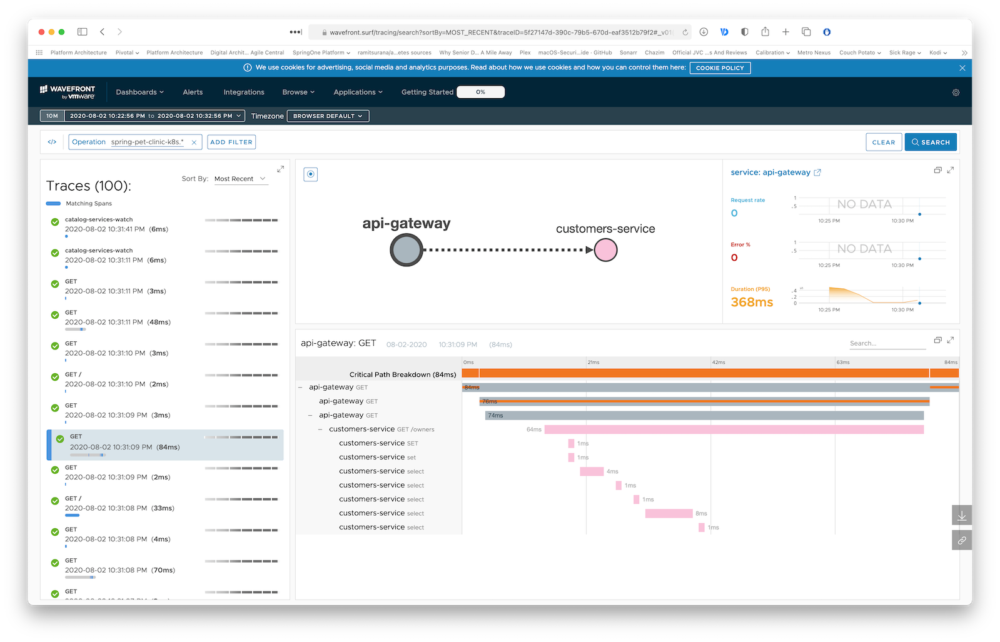

Access the one-time URL you received when bootstraping Wavefront to see Zipkin traces and other monitoring of your microservices:


Since we've included `brave.mysql8` in our `pom.xml`, the traces even show the various DB queries traces:


## Compiling and pushing to Kubernetes

This get a little bit more complicated when deploying to Kubernetes, since we need to manage Docker images, exposing services and more yaml. But we can pull through!

### Choose your Docker registry

You need to define your target Docker registry. Make sure you're already logged in by running `docker login <endpoint>` or `docker login` if you're just targeting Docker hub.

Setup an env varible to target your Docker registry. If you're targeting Docker hub, simple provide your username, for example:

```
export REPOSITORY_PREFIX=odedia
```

For other Docker registries, provide the full URL to your repository, for example:

```
export REPOSITORY_PREFIX=harbor.myregistry.com/demo
```

One of the neat features in Spring Boot 2.3 is that it can leverage [Cloud Native Buildpacks](https://buildpacks.io) and [Paketo Buildpacks](https://paketo.io) to build production-ready images for us. Since we also configured the `spring-boot-maven-plugin` to use `layers`, we'll get optimized layering of the various components that build our Spring Boot app for optimal image caching. What this means in practice is that if we simple change a line of code in our app, it would only require us to push the layer containing our code and not the entire uber jar. To build all images and pushing them to your registry, run:

```
mvn spring-boot:build-image -Pk8s -DREPOSITORY_PREFIX=${REPOSITORY_PREFIX} && ./scripts/pushImages.sh
```

Since these are standalone microservices, you can also `cd` into any of the project folders and build it indivitually (as well as push it to the registry).

You should now have all your images in your Docke registry. It might be good to make sure you can see them available.

Make sure you're targeting your Kubernetes cluster

### Setting things up in Kubernetes

Create the `spring-petclinic` namespace for Spring petclinic:

```
kubectl apply -f k8s/init-namespace/ 
```

Create a Kubernetes secret to store the URL and API Token of Wavefront (replace values with your own real ones):

```
kubectl create secret generic wavefront -n spring-petclinic --from-literal=wavefront-url=https://wavefront.surf --from-literal=wavefront-api-token=2e41f7cf-1111-2222-3333-7397a56113ca
```

Create the Wavefront proxy pod, and the various Kubernetes services that will be used later on by our deployments:

```
kubectl apply -f k8s/init-services
```

Verify the services are available:

```
✗ kubectl get svc -n spring-petclinic
NAME                TYPE           CLUSTER-IP     EXTERNAL-IP   PORT(S)             AGE
api-gateway         LoadBalancer   10.7.250.24    <pending>     80:32675/TCP        36s
customers-service   ClusterIP      10.7.245.64    <none>        8080/TCP            36s
vets-service        ClusterIP      10.7.245.150   <none>        8080/TCP            36s
visits-service      ClusterIP      10.7.251.227   <none>        8080/TCP            35s
wavefront-proxy     ClusterIP      10.7.253.85    <none>        2878/TCP,9411/TCP   37s
```

Verify the wavefront proxy is running:

```
✗ kubectl get pods -n spring-petclinic
NAME                              READY   STATUS    RESTARTS   AGE
wavefront-proxy-dfbd4b695-fdd6t   1/1     Running   0          36s

```

### Settings up databases with helm

We'll now need to deploy our databases. For that, we'll use helm. You'll need helm 3 and above since we're not using Tiller in this deployment.

Make sure you have a single `default` StorageClass in your Kubernetes cluster:

```
✗ kubectl get sc
NAME                 PROVISIONER            AGE
standard (default)   kubernetes.io/gce-pd   6h11m

```

Deploy the databases:

```
helm repo add bitnami https://charts.bitnami.com/bitnami
helm repo update
helm install vets-db-mysql bitnami/mysql --namespace spring-petclinic --version 6.14.3 --set db.name=service_instance_db
helm install visits-db-mysql bitnami/mysql --namespace spring-petclinic  --version 6.14.3 --set db.name=service_instance_db
helm install customers-db-mysql bitnami/mysql --namespace spring-petclinic  --version 6.14.3 --set db.name=service_instance_db
```

### Deploying the application

Our deployment YAMLs have a placeholder called `REPOSITORY_PREFIX` so we'll be able to deploy the images from any Docker registry. Sadly, Kubernetes doesn't support environment variables in the YAML descriptors. We have a small script to do it for us and run our deployments:

```
./scripts/deployToKubernetes.sh
```


Verify the pods are deployed:

```bash
✗ kubectl get pods -n spring-petclinic 
NAME                                 READY   STATUS    RESTARTS   AGE
api-gateway-585fff448f-q45jc         1/1     Running   0          4m20s
customers-db-mysql-master-0          1/1     Running   0          11m
customers-db-mysql-slave-0           1/1     Running   0          11m
customers-service-5d7d686654-kpcmx   1/1     Running   0          4m19s
vets-db-mysql-master-0               1/1     Running   0          11m
vets-db-mysql-slave-0                1/1     Running   0          11m
vets-service-85cb8677df-l5xpj        1/1     Running   0          4m2s
visits-db-mysql-master-0             1/1     Running   0          11m
visits-db-mysql-slave-0              1/1     Running   0          11m
visits-service-654fffbcc7-zj2jw      1/1     Running   0          4m2s
wavefront-proxy-dfbd4b695-fdd6t      1/1     Running   0          14m
```

Get the `EXTERNAL-IP` of the API Gateway:

```
✗ kubectl get svc -n spring-petclinic api-gateway 
NAME          TYPE           CLUSTER-IP    EXTERNAL-IP      PORT(S)        AGE
api-gateway   LoadBalancer   10.7.250.24   34.1.2.22   80:32675/TCP   18m
```

You can now brose to that IP in your browser and see the application running.

You should also see monitoring and traces from Wavefront under the application name `spring-petclinic-k8s`:




## Custom metrics monitoring

Grafana and Prometheus are included in the `docker-compose.yml` configuration, and the public facing applications
have been instrumented with [MicroMeter](https://micrometer.io) to collect JVM and custom business metrics.

A JMeter load testing script is available to stress the application and generate metrics: [petclinic_test_plan.jmx](spring-petclinic-api-gateway/src/test/jmeter/petclinic_test_plan.jmx)


### Using Prometheus

* Prometheus can be accessed from your local machine at http://localhost:9091

### Using Grafana with Prometheus

* An anonymous access and a Prometheus datasource are setup.
* A `Spring Petclinic Metrics` Dashboard is available at the URL http://localhost:3000/d/69JXeR0iw/spring-petclinic-metrics.
You will find the JSON configuration file here: [docker/grafana/dashboards/grafana-petclinic-dashboard.json]().
* You may create your own dashboard or import the [Micrometer/SpringBoot dashboard](https://grafana.com/dashboards/4701) via the Import Dashboard menu item.
The id for this dashboard is `4701`.

### Custom metrics
Spring Boot registers a lot number of core metrics: JVM, CPU, Tomcat, Logback... 
The Spring Boot auto-configuration enables the instrumentation of requests handled by Spring MVC.
All those three REST controllers `OwnerResource`, `PetResource` and `VisitResource` have been instrumented by the `@Timed` Micrometer annotation at class level.

* `customers-service` application has the following custom metrics enabled:
  * @Timed: `petclinic.owner`
  * @Timed: `petclinic.pet`
* `visits-service` application has the following custom metrics enabled:
  * @Timed: `petclinic.visit`
