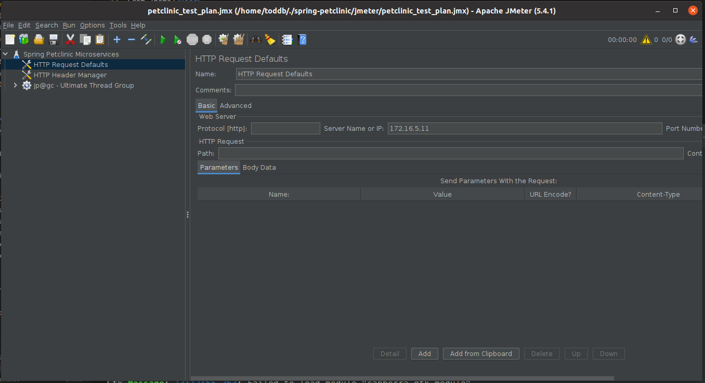

Add meter to your machine
From /home/<user>

In terminal run

```
wget https://mirrors.gigenet.com/apache//jmeter/binaries/apache-jmeter-5.4.1.zip
unzip apache-jmeter-5.4.1.zip
```
Now move the jmeter folder to /opt/ and set a soflt link from /opt/ to user

```
sudo mv apache-jmeter-5.4.1 /opt/
sudo ln -s /opt/apache-jmeter-5.4.1/bin/jmeter /usr/local/bin/jmeter
```
Download jmeter plugins manager from: https://jmeter-plugins.org/install/Install/

 And move it to the jmeter install dir '/lib/etx'

```
sudo mv jmeter-plugins-manager-1.6.jar /opt/apache-jmeter-5.4.1/lib/ext
```

Open the petclinic jmeter test plan from the terminal.

This will open the jmeter gui

From outside the spring-petlicic project directory

Run command

```
jmeter -t ./spring-petclinic/jmeter/petclinic_test_plan.jmx
```

You should then get the jemeter ui




In here you want to change "Server name or IP" to match the External IP of your api-gateway service and set "Port Number to 80