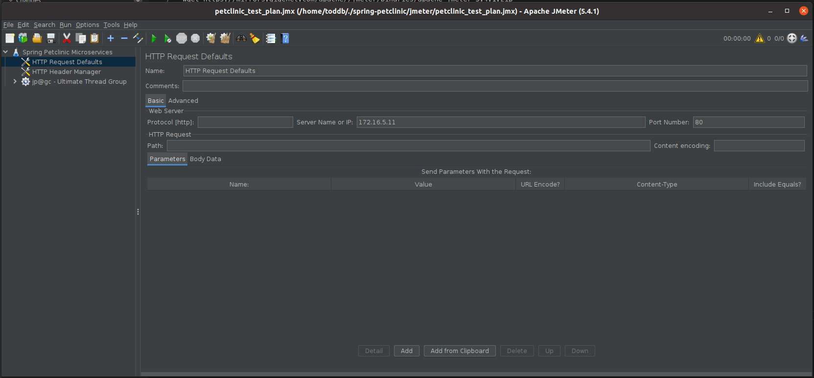

### This install is for a lab that uses an Ubuntu Desktop to work from. 
If you have jemter or need to follow other install direction all you really need is the plan which is is in *spring-petclinic/jmeter* 

1. #### Add jmeter to your machine ####

From "/home/{user}"

Run the commands to download and uppack jmeter

```
wget https://mirrors.gigenet.com/apache//jmeter/binaries/apache-jmeter-5.4.1.zip
unzip apache-jmeter-5.4.1.zip
```

2. #### Move the jmeter folder to /opt/ and set a soflt link from /opt/ to user ####

```
sudo mv apache-jmeter-5.4.1 /opt/
sudo ln -s /opt/apache-jmeter-5.4.1/bin/jmeter /usr/local/bin/jmeter
```
3. #### Download jmeter plugins manager from: https://jmeter-plugins.org/install/Install/

 And move it to the jmeter install dir '/lib/etx'

```
sudo mv jmeter-plugins-manager-1.6.jar /opt/apache-jmeter-5.4.1/lib/ext
```

4. #### Open the jmeter gui and the provided petclinic test plan from the terminal. ####


Run command

```
jmeter -t ./spring-petclinic/jmeter/petclinic_test_plan.jmx
```

You should then get the jmeter ui




In here you want to change "Server name or IP" to match the External IP of your api-gateway service and set "Port Number to 80

Then click the "Run" button

Expand the test plan and click "View Results Tree" to make sure tests are running ok


You should also see new data showing in the app


Back to Main [README](../README.md)